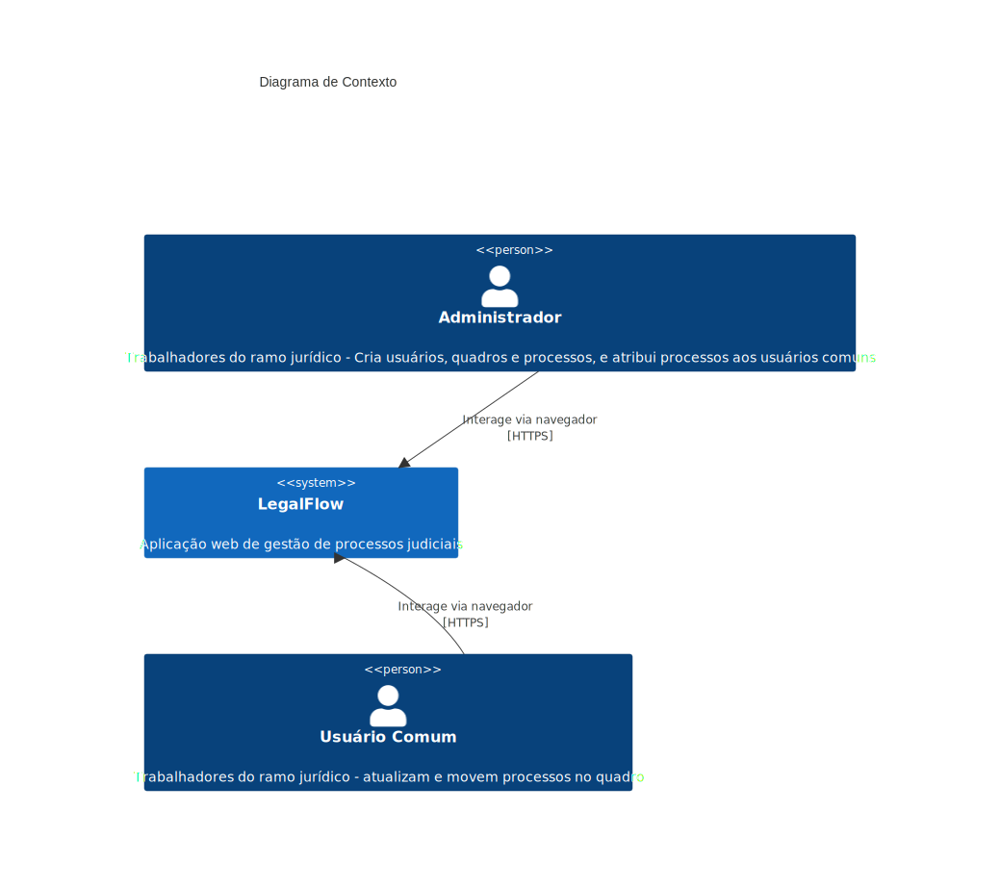
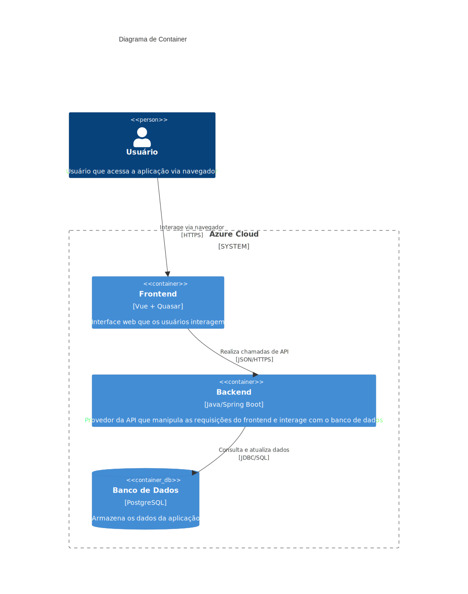
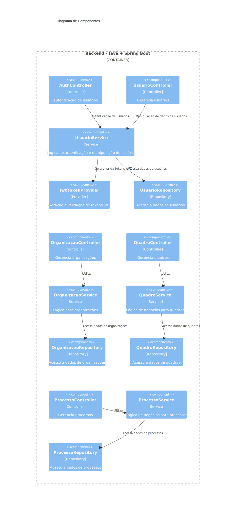
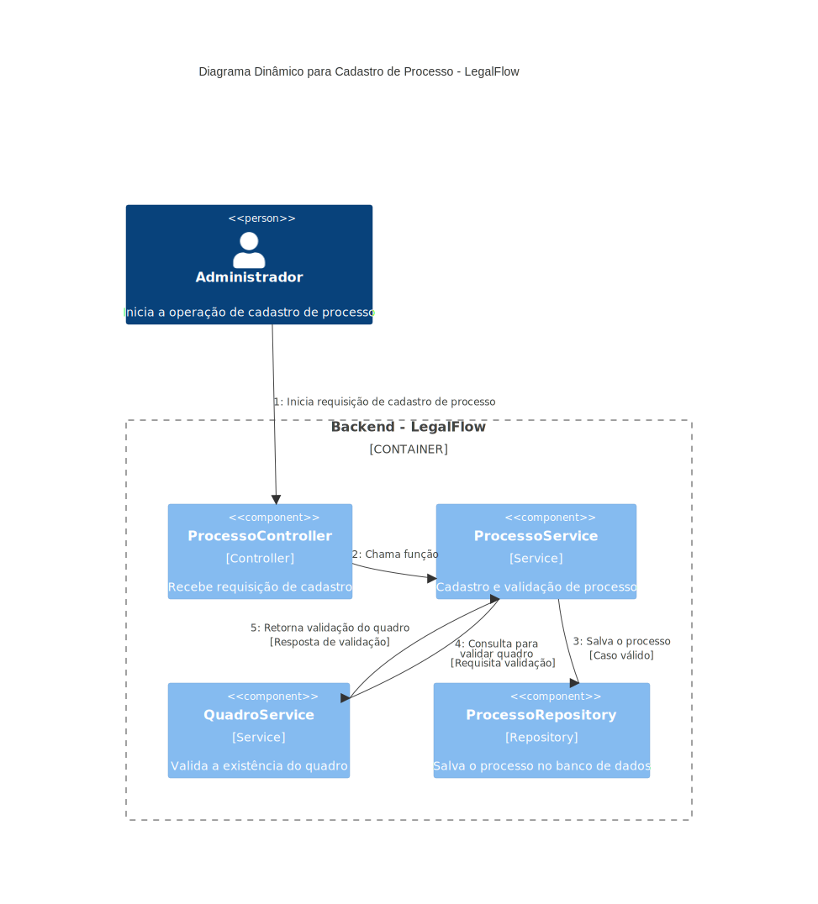

# LegalFlow

LegalFlow é uma plataforma de gestão de processos judiciais que funciona como um kanban, permitindo o acompanhamento de processos através de diferentes status. O sistema é projetado para ser utilizado por escritórios de advocacia e departamentos jurídicos para gerenciar seus casos de forma eficiente.
A finalidade do projeto é trazer a metodologia ágil para dentro do mundo jurídico, ajudando na agilização e acompanhamento de processos.

<br />

## Funcionalidades

- **Cadastro de Usuários**: 
  - Um usuário administrador pode se cadastrar e, dentro de sua conta, cadastrar outros usuários (administradores ou usuários comuns).
  
- **Gestão de Processos**:
  - O administrador pode cadastrar novos quadros e, dentro destes quadros, novos processos, incluindo detalhes como número do processo, nome, réu, autor, observações e anexos (PDF até 10mb).
  - Atribuição de quadros de processos a usuários responsáveis.

- **Acompanhamento de Status**:
  - Os processos podem ser acompanhados através de status como: Criado, Em Progresso, Finalizado, Arquivado.
  - Usuários responsáveis podem alterar o status e detalhes dos processos sob sua responsabilidade.

<br />

## Tecnologias Utilizadas

- **Backend**: 
  - Java com Spring Boot
- **Frontend**: 
  - Vue.js com Quasar Framework
- **Banco de Dados**: 
  - PostgreSQL
- **Conteinerização**: 
  - Docker
- **Cloud**
  - Azure
- **Monitoramento**
  - Azure
  - <a href="https://sonarcloud.io/project/overview?id=Tekislla_legalflow">SonarCloud</a>
  - JaCoCo para code coverage

<br />

## Requisitos

- **Java 17+**
- **Node.js 16+**
- **Docker**
- **PostgreSQL**

<br />  

## Diagramas modelo C4

### Diagrama de contexto


### Diagrama de container


### Diagrama de componentes


### Diagrama dinâmico


<br />

# Como Executar o Projeto

## Ambiente completo

1. Renomeie o arquivo .env.example para .env, e defina o valor das variáveis para "container"

   ```
   SPRING_PROFILES_ACTIVE=container
   QUASAR_PROFILE_ENV=container
   ```

2. Navegue até a raiz do projeto e execute:

    ```
    docker-compose up -d --build
    ```
    
Isso irá subir o backend, frontend e banco de dados em contêineres separados, porém dentro de um compose.

<br />

## Ambiente separado (para desenvolvimento)

### Backend

   
1. Navegue até a pasta do backend:

   ```
   cd backend/legalflow
   ```


2. No caminho src/main/resources/application.yml, altere a property spring.profiles.active para "local":

    ```
    spring:
      profiles:
        active: local
    ```

3. Suba o banco de dados:

    ```
    docker run --name legalflow_db -e POSTGRES_DB=legalflow -e POSTGRES_USER=postgres -e POSTGRES_PASSWORD=postgres -p 5432:5432 -d postgres
    ```

4. Execute o projeto:

    ```
    mvnw spring-boot:run
    ```

<br />

### Frontend

1. Navegue até a pasta do frontend:

    ```
    cd legalflow/frontend
    ```

2. Instale as dependências:

    ```
    npm install
    ```
    
3. Execute o projeto:
   
    ```
    npm run dev
    ```

<br />

## Licença

Este projeto é protegido por direitos autorais. Todos os direitos estão reservados. 

A reprodução, distribuição ou modificação do código deste repositório sem a permissão explícita do autor é estritamente proibida. Para quaisquer dúvidas ou solicitações, entre em contato com o autor.
